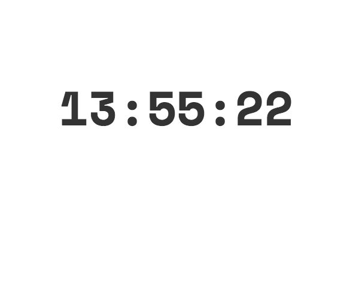

# Flexitive Page API v1

## Overview
The Page API is a way to customize the behavior and content of pages built in [Flexitive](https://flexitive.com). The Page API enables:

* control of page load
* creation of custom elements
* reacting to Page events
* connecting dynamic elements to external data sources

## Getting Started
Pages exported from Flexitive automatically include the Page API. In `index.html` you will find an empty `<script>` block in which to place your code.

```javascript
<script>
  /**
   * Flexitive Page API v1
   * Documentation: https://github.com/Flexitive/page-api/tree/v1
   */

  /* Insert your code here */

  Page.start();
</script>
```

## Controlling the Page

### `Page.start()`
Triggers the page load sequence, eventually causing it to render in the browser and start animations. This should be called exactly once, and only after configuring the Page (e.g. creating custom elements, registering event listeners, etc).

**The page will not render unless `Page.start()` is called**

## Custom elements
*Custom elements* are a special kind of element added to pages in the Flexitive editor. These elements are defined at runtime using the Page API. This includes:

* how the element looks
* how the element changes over time
* how the element responds to user interaction

When exporting a page, Flexitive automatically includes skeleton API code for any custom elements, e.g.:

```javascript
Page.customElement('rYprMHj5NiS#ImpressiveAnimation', {
  load: function (container, size, done) {
    // load element assets, populate element, callback when done
  },
  resize: function (container, size) {
    // called when the element changes size
  },
  appear: function () {
    // called when element appears in animation
  },
  disappear: function () {
    // called when element disappears in animation
  },
  stop: function () {
    // called when element should stop/skip its animation
  }
});
```

Custom elements always have a unique name which allows them to be referenced in code.

Defining a custom element involves implementing API hooks which are called by the Page Runtime on load and during execution. These API hooks are described below.

`load` is always called first. The other functions can be called in any order.

### `load` (required)
Load any data (images/videos/json etc) required by the element, populate `container` with HTML you want to display when the element appears, and call `done` when ready.

This function should preload *all* asset before calling `done`. For example if the element has an image dependency, it should be [preloaded via Javascript](http://blog.teamtreehouse.com/learn-asynchronous-image-loading-javascript). This helps to avoid any loading issues after the page has started.

`size` is an object with `width` and `height` properties, representing the dimensions of the custom element. This is useful if the element content needs to respond to the element size.

`load` is called by the Page Runtime early in the page load sequence. The page will not start until all elements have finished loading.

This example populates the element with a red `<div>`:

```javascript
{
  ...

  load: function (container, size, done) {
    this.div = document.createElement('div');
    this.div.style.backgroundColor = 'red';
    this.div.style.width = '100%';
    this.div.style.height = '100%';
    container.appendChild(div);
    done();
  },

  ...
}
```

### `resize` (optional)
Update the element HTML content when the element size changes (e.g. if the browser window is resized).

### `appear` (optional)
Do something when the element appears. Typically this is where custom animations would be started.

This example uses [Greensock](https://greensock.com/) to animate the background color of the element when it appears:

```javascript
{
  ...

  appear: function () {
    TweenLite.to(this.div, 1.0, { backgroundColor: "green" });
  },

  ...
}
```

Note that we're referencing a HTMLElement (`this.div`) defined earlier in the `load` function.

### `disappear` (optional)
Do something when the element disappears.

### `stop` (optional)
Do something when the page has been "stopped" - an example would be if the user initiates a clickthrough. An example response would be to stop any video/audio playing in the element.

## Events (coming soon)
Events allow custom code to be executed in response to Page events. Event listeners will receive an object containing metadata about the event. The following events are emitted:

| Event | Description |
| --- | --- |
| click | Emitted whenever the user clicks on the page. Metadata may include a `clickUrl` or `clickName`, which should trigger a redirect to a new URL. It's up to the event listener to decide how this happens. |

### `Page.listen(eventName, callback)`
The callback should take a single argument, the event's metadata object. Subsequent calls with the same `eventName` will overwrite the previous listener.


## Examples

| Example | Description |
| --- | --- |
| Clock [](examples/clock/index.html#L43) | Basic example demonstrating how to populate a custom element with a live digital clock. [View the code >](examples/clock/index.html#L43) |
| Animated Highlight [](examples/animated-highlight/index.html#L43) | Demonstrates how to import an external library (Greensock), and use it to create an animated highlight effect. [View the code >](examples/animated-highlight/index.html#L43) |
